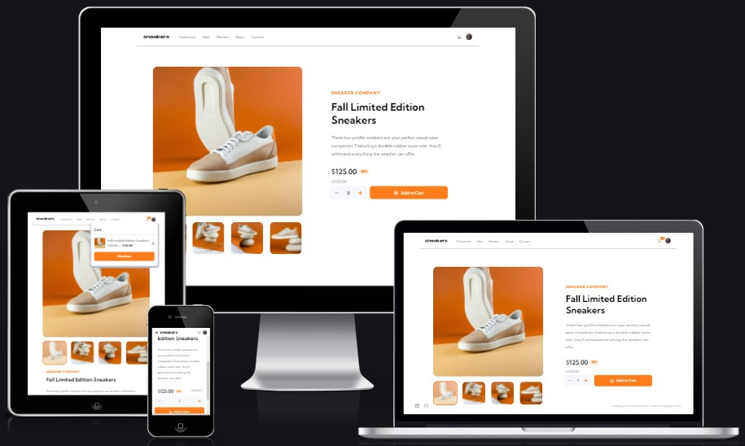
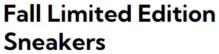
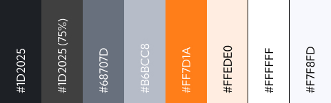

# E-commerce Product Page

This is a website that I created for my final milestone project. To build an E-commerce product page.

The concept for this site was to build a static one-page e-commerce product page, to develop a image scroll for mobile, a pop-up light box for the desktop site and have functionality to add, delete and checkout products in the cart.

## Showcase

 // To change file link

A deployed version of my website can be found [here](https://elliej87.github.io/ecommerce-product-page-main/)

This domain will allow you to access the E-commerce Product Page, which I have completed as part of the Code Institute Milestone 3 Project.

## Table of Contents

1. [User Experience UX](#userexperienceuX)

   - [User Stories](#userstories)

     - [As a New User](#newuser)
     - [All Users](#allusers)
     - [Site Owner Goals](#sitegoals)

2. [Design](#designtheme)

   - [Fonts](#fontsused)
   - [Colours](#coloursused)
   - [Wireframes](#wireframesboards)

3. [Features](#featuressite)

   - [Navbar](#navbar)
   - [Shopping Cart](#shoppingcart)
   - [Product Image](#productimage)
   - [Product Information](#productinformation)
   - [Light Box - Desktop](#lightbox)
   - [Mobile Scroll - Mobile](#mobilescroll)
   - [Toast](#toast)
   - [Footer](#footerfeatures)

4. [Technologies Used](#technologies)

   - [Version Control](#versioncontrol)

5. [Testing](#testingcases)

6. [Implementation](#implementationtest)

7. [Deployment](#deploymentsite)

   - [Repository Link](#repositorylink)
   - [Running Code Locally](#runningcodelocally)

8. [Credits](#finalcredits)

   - [Content](#contentsite)
   - [Acknowledgments](#acknowledgmentsthanks)

## <a name="userexperienceuX">UX (User Experience)</a>

My website is for one e-commerce product page, where the user is interested in the current drop from the company 'Sneakers'. The user can see a main image, smaller images when clicked will change the main image, open a lightbox to see the image in a larger scale. Able to add as many pairs to their basket, delete the basket quantity or checkout the basket quantity.

Use of white space to showcase the product and text, with a pop of orange to accent the companies main colour theme. Subtle hover navigation and movement to bring depth to the product page.

## <a name="userstories">User Stories</a>

### <a name="newuser">As a New User</a>

- I want to clearly see the picture of the product and additional images
- I want to know the price of the product and if there is any discount on the product
- I want to see information about the product I am buying
- I want to know which active thumbnail image is selected

### <a name="allusers">All Users</a>

- I want there to be a main image and smaller images to see different views of the product
- I want to click on the thumbnail and it changes the main image to correspond to the image I clicked on
- I want to click the main image (on desktop) and a light box shows the main image and thumbnails
- I want to click on the thumbnail images on the lightbox and this changes the main lightbox image
- I want the arrows in the lightbox to scroll through the images and changes the active state of the thumbnails
- I want to be able to close the lightbox image by clicking on the cross
- I want the mobile display to have just 1 image and to be able to scroll through the thumbnail images without being show on the mobile screen
- I want to add the product to the cart, by clicking the plus sign adds the amount stated to the cart
- I want to see if the cart is either empty or has the product added to the cart
- I want to be able to delete all items in the cart
- I want to be able to checkout the items in the cart
- I want to be able to see and interact with them via social media

### <a name="sitegoals">Site Owner Goals</a>

- As a site owner I want to ensure the user has an ease of navigation
- As a site owner I want the user to be able to select as many pairs of shoes to add to the cart
- As a site owner I want the user to be able to delete the items in the cart or checkout the items in the cart
- As a site owner I want the user to have the same experience as on desktop and on mobile where they can navigate through all the images on their phone or open up a lightbox and navigate through the images on their desktop

## <a name="designtheme">Design</a>

### <a name="fontsused">Fonts</a>

For my site I choose the font [Kumbh Sans](https://fonts.google.com/specimen/Kumbh+Sans?query=Kumbh+Sans) for the whole site theme, apart from the company title 'Sneakers', this is a very clean font and is versatile on how it looks.

### <a name="coloursused">Colours</a>

For the colours, I wanted this to be clean and soft, with one main accent colour. With a white background and soft greys so it's not too harsh, this adds depth to the page and places a sense of hierarchy within the page. With the accent colour of orange this features on: the buttons, titles and accents of hover states on the links, cart, avatar and border for the thumbnails with a slight white opacity.

I feel this range of soft making the page very clean and ensuring the product is the main feature of the page.

### <a name="wireframesboards">Wireframes</a>

The wireframes were created using [Figma](https://www.figma.com) and the imagery can be found in the wireframes in jpg format.

| Desktop & Laptop                                                                                                                                      | Tablet & Mobile                                                                                                                                  |
| ----------------------------------------------------------------------------------------------------------------------------------------------------- | ------------------------------------------------------------------------------------------------------------------------------------------------ |
| [Index](https://github.com/EllieJ87/ecommerce-product-page-main/blob/master/readme-docs/wireframes/desktop-index.jpg)                                 | [Index](https://github.com/EllieJ87/ecommerce-product-page-main/blob/master/readme-docs/wireframes/mobile-index.jpg)                             |
| [Index - Empty Cart](https://github.com/EllieJ87/ecommerce-product-page-main/blob/master/readme-docs/wireframes/desktop-index-cart-empty.jpg)         | [Index - Empty Cart](https://github.com/EllieJ87/ecommerce-product-page-main/blob/master/readme-docs/wireframes/mobile-index-cart-empty.jpg)     |
| [Index - Product Cart](https://github.com/EllieJ87/ecommerce-product-page-main/blob/master/readme-docs/wireframes/desktop-index-cart-product.jpg)     | [Index - Product Cart](https://github.com/EllieJ87/ecommerce-product-page-main/blob/master/readme-docs/wireframes/mobile-index-cart-product.jpg) |
| [Index - Lightbox](https://github.com/EllieJ87/ecommerce-product-page-main/blob/master/readme-docs/wireframes/desktop-index-lightbox.jpg)             |                                                                                                                                                  |
| [Index - Lightbox Hover](https://github.com/EllieJ87/ecommerce-product-page-main/blob/master/readme-docs/wireframes/desktop-index-lightbox-hover.jpg) |                                                                                                                                                  |
|                                                                                                                                                       | [Index - Navbar](https://github.com/EllieJ87/ecommerce-product-page-main/blob/master/readme-docs/wireframes/mobile-index-nav.jpg)                |

## <a name="featuressite">Features</a>

This section is a brief highlight of features that this site contains, why they are the way they are as well as any future improvements or additions that would take this site from strength to strength.

### <a name="navbar">Navbar</a>

- Main company logo 'Sneakers' is located on the top left of the screen
- Links to: 'Collections', 'Men', 'Women', 'About' and 'Contact' run along next to the main company logo. (Links are not functionable)
- All links on the desktop / Tablet layout have a subtle hover state with a strong orange colour bottom border and a bolder font weight to emphases which state is being hovered over
- Cart Icon is on the right side of the screen with padding between the avatar logo, this is in a strong grey-blue colour taken from the colour palette
- Cart Icon has a strong orange hover state
- Avatar Logo, is located to the right of the cart icon and screen this has an orange border around the image.
- Navigation has a minimalistic Line to set a clear definition on the end of the nav

**Mobile Display**

- Hamburger icon is visible next to the 'Sneakers' logo on the far left side
- When hamburger icon is clicked this shows the: 'Collections', 'Men', 'Women', 'About' and 'Contact' links, this nav bar takes up half the screen width and is in solid white with a black opacity back drop.
- Navigation links have a hover state of change colour in orange with bold text
- Close 'X' button is in the top left of the screen to close the nav bar
- 'X' Button has a hover state of change colour in orange

### <a name="shoppingcart">Shopping Cart</a>

- Cart Icon has a hover state of change colour in orange
- When Cart icon is clicked this shows the cart basket with a soft transition
- When the cart is empty the user can see the Cart title and the text 'Your cart is empty'
- When cart has product in, a quantity count indicator is visible to state how many items are in the cart
- Cart quantity indicator is in an orange badge with soft borders and with white font colour
- When cart has the product in, cart displays an image, product title, price, the quantity added, cart total price and a trash icon (to delete), these are all displayed on one line.
- The cart has a 'Checkout' button which has the same styling and hover state as the 'Add to Cart' button, this is located underneath the product information and takes up the full width of the cart, including the same amount of padding
- The 'Trash' icon is displayed to remove the full quantity of the products in the cart
- The 'Checkout' button is visible to replicate the process of the item being purchased (this button does not take the user to a payment page / takes any payment it has a toast function to state this button has an action and to stimulate the elements being paid for, further backend coding / development will need to be put into place to take payments and handling this data)
- Cart is fixed and the user is unable to scroll down the page when this is open
- User can click outside of the cart or click the cart icon to close the cart display

### <a name="productimage">Product Image</a>

- Main product image is located to the left of the screen and takes up half the container width, not the full width to ensure there is enough white space around the imagery and text
- On smaller width screens to tablet size, main image is stacked on top of the thumbnails and product information text
- Thumbnail images are displayed underneath the main image to showcase additional image shots of the product
- Thumbnails has an active state when the user clicks on the image, image has an opacity and a strong orange border to indicate it's active state. main image changes to reflect which image is being clicked on

### <a name="productinformation">Product Information</a>

- Company name title is at the top of the product information container, this is in orange uppercase and has letter spacing, for clear readability, font is smaller than product title
- Product name is underneathe the company name title, font colour in black which is in larger so the user knows that this is the product title
- Information about the product is underneath the product name in a deep mid blue colour highlighting keep descriptions about the showcased product
- Current price in bold black larger font to indicate to the user the cost of the product which sits under the product information
- Reduced markdown percent badge is next to the current price, this is encased in a light orange background with a strong bold orange colour to add a clear indication of a markdown percent
- There is the original cost price which sits under the new price and reduce percent, this is in italic styling strike out in a light grey colour to show it's less importance but to be visible to the user of the old price
- Increase and decrease buttons so the user can add or as little as they want - have a hover state - and a de-active state
- Quantity button has a 'minus (-)' and 'plus (+)' button with the quantity number centred of the buttons
- User can add the chose the amount they wish by clicking on the '+' or '-' button this will update the quantity number in the quantity button. This number will add that amount of products into the cart
- '+' and '-' buttons has a hover colour change and also has a de-active state so the user knows they need to add at least 1 product to the cart
- Both 'Add to Cart' and quantity buttons are in a row in the main container under the price information
- 'Add to Cart' button has a box shadow and text of 'Add to Cart' is in bold when the user hovers over

**Mobile / Tablet Display**

- For the mobile layout the current price, reduced price and the original price are displayed in a row on one line
- Both 'Add to Cart' and quantity buttons are stacked, the quantity button is ontop of the 'Add to Cart' this is to ensure the user has enough screen space to select the right button option, and utilising the space more

### <a name="lightbox">Light Box - Desktop</a>

- When the main image is clicked a light box is displayed, showing the main image, thumbnails, arrow left, arrow right and a close button
- The user can click on the thumbnail and this changes the main product image
- When the user clicks on either the left or right arrow this takes the user to the next or previous image
- Thumbnail image has an active state so when the user clicks or actions the left / right arrow buttons, the thumbnail has an opacity and has a strong orange border around it
- Both the left and right arrows has a hover state, this changes the arrow colour to orange and has slight movement by changing the position further over
- The close button is situated in the top right of the lightbox
- The close button has a hover state of orange to indicate the user has hover over it - this is the only way to close the lightbox

### <a name="mobilescroll">Mobile Scroll - Mobile</a>

- Main product is situated at the top - takes full width of the screen
- Right and left arrows are displayed
- When the user clicks on either the left or right arrow this takes the user to the next or previous image
- Both the left and right arrows has a hover state, this changes the arrow colour to orange and has slight movement by changing the position further over
- Thumbnails are hidden to minimize the amount taken on the screen

### <a name="toast">Toast</a>

- A small toast indication when the user, adds, removes or checkout the items in the cart
- This is located to the right of the screen, same position as the cart with a transition on it
- Has an orange background colour with bold white font
- When the user clicks the 'Add to Cart' button the number added is displayed in the toast with the text 'Added to Cart'
- When the user clicks the 'Trash' icon the toast with the text 'items removed from cart' is displayed
- When the user clicks the 'Checkout' button the toast with the text 'Thank you for your Purchase' is displayed

### <a name="footerfeatures">Footer</a>

- Contains the copyright text, this is in the right side of the page this then is centred and on top of the navigation links in smaller screens for easy readability.
- Contains the ‘LinkedIn’ and ‘GitHub’ navigation links on the left side of the page and evenly spaced these and then stacked underneath the header title, these are all centred to the width of the screen
- All navigation links have a colour change when the user hover over the icon, this is so the user knows they are interactive and have a purpose
- The ‘LinkedIn’ and ‘GitHub’ icons opens a new window to the relevant page
- The footer runs along and is fixed at the bottom with no fill colour to make this easy to read and visual appealing

## <a name="technologies">Technologies Used</a>

[Bootstrap](https://getbootstrap.com)

- The project uses the Bootstrap framework to add a responsive grid system, prebuilt components, plugins built on jQuery, and Bootstrap styles to my game, before adding my own custom styling

[CSS](https://en.wikipedia.org/wiki/CSS)

- The project uses CSS to apply the custom styles to create the look of my game. The index.html file is linked directly to the main.css stylesheet

[Figma](https://www.figma.com)

- I used Figma to design the wire frames for the site

[Font Awesome](https://fontawesome.com/v4.7/)

- The project uses Font Awesome icons for all navigation and social media links that feature in the header and footer of my site

Google Chrome Dev Tools

- For testing purposes for responsive design

[Google Fonts](https://fonts.google.com)

- Google fonts was used to import ‘Orbiton font and ‘Sarpanch’ into the HTML which is used on all pages throughout the project.

[HTML5](https://en.wikipedia.org/wiki/HTML5)

- The project uses HTML to create the basic elements and content of my game

[JavaScript](https://en.wikipedia.org/wiki/JavaScript)

- The project uses JavaScript from my custom script.js file to add functionality and interactivity to my text adventure game. This is the core focus of this project. The project also uses JavaScript from Bootstrap which is required to add functionality to the Bootstrap modal

[jQuery](https://en.wikipedia.org/wiki/JQuery)

- The project uses jQuery to simplify DOM manipulation. This is both the standard jQuery that is built with Bootstrap components, and my custom jQuery used in my index.html and script.js files

[SCSS](https://en.wikipedia.org/wiki/CSS)

- The project uses SCSS/SASS to apply the custom styles to create the look of the site. The index.html file is linked directly to the style.css stylesheet
- SCSS also enabled me to create re-usable variables and to keep areas of the site separate to make this easier to target and navigate when changing the styling.

[Visual Studio Code](https://code.visualstudio.com)

- I used Visual Studio Code as the development environment to write the code for my website

### <a name="versioncontrol">Version Control</a>

[Git](https://git-scm.com)

- I've used Git as a version control system to regularly add and commit changes made to project in Visual Studio Code, before pushing them to GitHub.

[GitHub](https://github.com)

- I've used GitHub as a remote repository to push and store the committed changes to my project from Git. I've also used GitHub pages to deploy my website in a live environment.

## <a name="testingcases">Testing</a>

Testing can be found [here](TESTING.md)

## <a name="implementationtest">Implementation</a>

As this is my first time building a e-commerce product page, learning a lot from my previous projects has pushed my skills with Scss and JavaScript more as this is more a reflection on how web pages are structured. I do like to problem solve and research different methods to try and resolve the issues that I was facing. To do this I would mainly use Dev Tools in Google Chrome. By using elements of Bootstrap, was the foundation to ensure this project was responsive, but I used a lot of my own custom Scss to ensure the styling was coherent to the brief, especially ensuring the screen size dimensions were a different and device friendly layout. When testing I would use a combination of isolating he chosen areas and focus on that part, which became tricky when putting them onto the main site to ensure they worked to how these have been tested.

## <a name="deploymentsite">Deployment</a>

The hosting platform that I've used for my project is GitHub Pages. To deploy my website to GitHub pages, I used the following steps:

- Loaded the terminal window in my visual studio code workspace
- Initialised Git using the Source Control in the control panel
- Files that have been amended are automatically listed in the ‘Source Control’ panel
- Add message in the ‘Message’ section, making sure the commits are clear and concise (re-checked previous commits for layout and what was fixed / still pending)
- Click the ‘tick’ icon which stored the files in visual studio code
- Click the ‘ellipsis’ icon and select the ‘push’ option
- This then push all files and commits to the main branch
- This will add the updated files into the ‘main branch’ option under the ‘GitHub pages’ section
- Ran several commits after testing was carried out throughout my project.

### <a name="repositorylink">Repository Link</a>

[E-Commerce Product page](https://elliej87.github.io/ecommerce-product-page-main/)

### <a name="runningcodelocally">Running Code Locally</a>

To run my code locally, users can download a local copy of my code to their desktop by completing the following steps:

- Go to my GitHub repository.
- Click on 'Clone or download'.
- Click on 'Download ZIP'.
- Once downloaded, extract the zip file's contents and run my website locally.

## <a name="finalcredits">Credits</a>

- [Font Awesome](https://fontawesome.com/v4.7/) for the many icons that I have used throughout the various pages
- [Bootstrap](https://getbootstrap.com) We have had fun along the way, but overall, for your superb features that you provide to enabled me to add in without having to code too much myself, although there was quite a bit of tinkering with the CSS, but we're still friends
- Shout out to [JavaScript](https://en.wikipedia.org/wiki/JavaScript) where I spent most days, mornings and nights seeing if I could tackle you or not!

## <a name="contentsite">Content</a>

The bulk of content on this site has been written by me in order to give the website information, purpose and meaning. I have spent many months in preparation for this website ensuring there is enough diverse content and that all has a similar hand styling and theme.

## <a name="acknowledgmentsthanks">Acknowledgments</a>

Firstly, I would like to thank my Mentor Sunny Hebbar for honest, helpful and continuous feedback, without this I wouldn’t have been able to push myself, giving me helpful sites to understand JavaScript more. Sunny has been absolutely superb to work with! I really enjoy our mentor sessions together and can't thank Sunny enough for all the help and support that has been given to me. Thank you again, I really appreciate all your help and support.

I would like to also thank my brother Sam Judge who has helped me isolate problems and solve elements one by one to help manage my time and problem solving, this has helped me keep myself focussed. He has also help support me when the times have been very tough and times of uncertainty of my capabilities.

I would also like to thank the [Stack Overflow](https://stackoverflow.com) and [Slack](https://slack.com/intl/en-gb/) Community for helping me fix issues and errors.

I promise one day I will revisit this site once I have finished this course to keep pushing the limits to further add new exciting elements to this project to go above and beyond!

_**Created by Ellie Judge**_

sneakers logo is sitting up
cart opsition on desktop
toast position on desktop
