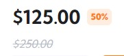
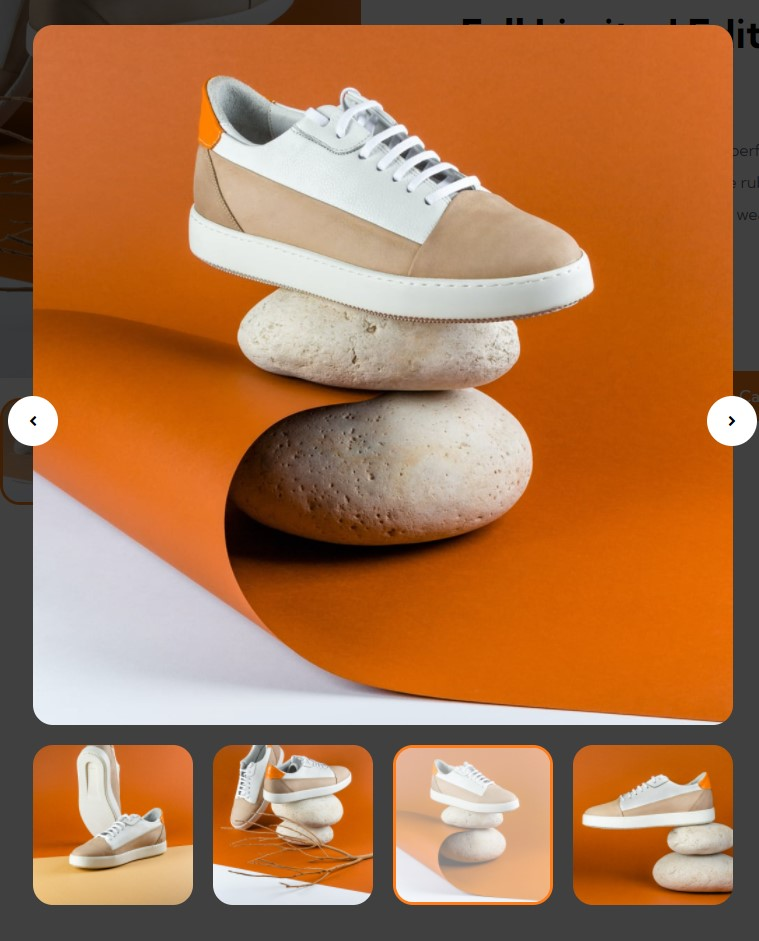
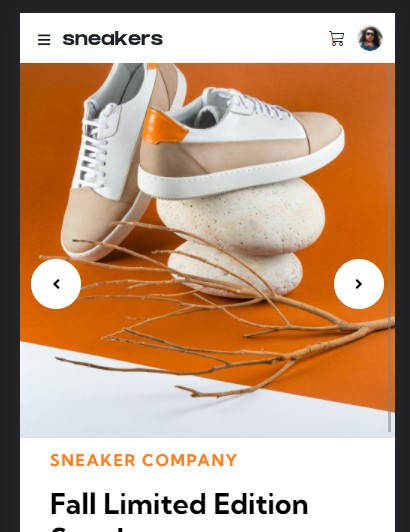
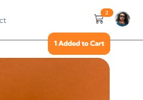
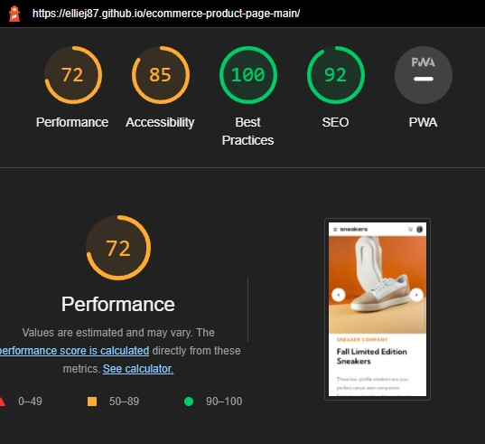

# Testing

## Contents

1. [Functionality Testing](#functionalitytesting)

   - [Desktop Main Image](#desktopmainimage)
   - [Navbar](#navbar)
   - [Desktop Lightbox](#desktoplightbox)
   - [Mobile Main Image](#mobilemainimage)
   - [Add to Cart](#addtocart)
   - [Shopping Cart](#shoppingcart)
   - [Toast](#toast)

   - [Footer Social Navigation Links](#footerlinks)

     - [LinkedIn Icon](#linkedinicon)
     - [GitHub Icon](#githubicon)

2. [Testing User Stories](#testinguserstories)

   - [As a New User](#newuser)
   - [All Users](#allusers)

3. [Responsive Design Testing](#responsivedesigntesting)

4. [Performance Testing](#performancetesting)

5. [Validation](#validationcode)

   - [HTML](#htmlcode)
   - [CSS](#csscode)

6. [Bugs](#bugsfixes)

# <a name="functionalitytesting">Functionality Testing</a>

Browsers tested: Google Chrome, Mozilla Firefox & Opera.
The devices used in this testing include Samsung S10 v.Android 10.

## <a name="navbar">Navbar</a>

Expected: Navbar is visible along the top with, hover links, Cart hover and avatar hover displaying
Testing: Hovering over the links, cart and avatar logo
Results: Links display a bottom border on hover, cart changes colour on hover, avatar has a border on hover

### Responsiveness

Expected: Navbar to be a collapsed burger
Testing: reducing the screen size to mobile
Results: Navbar hamburger is visible on mobile screen

Expected: Navbar to open when the user clicks on the hamburger icon
Testing: clicking the hamburger icon
Results: Mobile navbar is displayed - takes up half the mobile screen width

## <a name="desktopmainimage">Desktop Main Image</a>

Expected: Lightbox to be displayed when main image is clicked
Testing: clicking on the main image
Results: lightbox is displayed

Expected: Thumbnail to change active state
Testing: clicking on a thumbnail
Results: the thumbnail clicked adds an 'active' class of an opacity and solid orange border

Expected: When thumbnail is clicked the main image is changed
Testing: clicking on a thumbnail
Results: the thumbnail clicked the main image is updated and displays that correct thumbnail

## <a name="desktoplightbox">Desktop Lightbox</a>

Expected: Lightbox to be displayed when clicking on the main image
Testing: clicking on the main image
Results: lightbox is displayed

Expected: Thumbnail to change active state
Testing: clicking on a thumbnail
Results: the thumbnail clicked adds an 'active' class of an opacity and solid orange border

Expected: When thumbnail is clicked the main image is changed
Testing: clicking on a thumbnail
Results: the thumbnail clicked the main image is updated and displays that correct thumbnail

Expected: Main image to change to the next thumbnail when either the left/right arrow is clicked
Testing: clicking on the arrow icon
Results: next thumbnail image in the sequence is displayed and active class is updated

Expected: Left and right icon to have a hover state and animation when clicked/hovered
Testing: clicking/hovering on the arrow icon
Results: hover state and animation is triggered

Expected: Click the 'X' button to close the lightbox
Testing: clicking the 'x' button
Results: closes the lightbox

### Responsiveness

Expected: To be only visible and active on larger devices
Testing: changing the screen sizes through Google Chrome Dev tools and clicking the image to see when the light box will display
Results: lightbox is only visible on larger screens

## <a name="mobilemainimage">Mobile Main Image</a>

Expected: Main image to change to the next thumbnail when either the left/right arrow is clicked
Testing: clicking on the arrow icon
Results: next thumbnail image in the sequence is displayed and active class is updated

Expected: Thumbnails to be hidden
Testing: changing the screen sizes through Google Chrome Dev tools to see when the thumbnails are hidden
Results: thumbnails are hidden on mobile displays

## <a name="addtocart">Add to Cart</a>

Expected: When clicking the '+' button the number increases
Testing: clicking the '+' button
Results: quantity number increases

Expected: When clicking the '-' button the number decreases
Testing: clicking the '-' button
Results: quantity number decreases

Expected: When clicking the '-' button when the number is at 0 the count stops and the button becomes disabled
Testing: clicking the '-' button at number 0
Results: the number does not decrease pass 0

Expected: Nothing is added when the count is at 0
Testing: clicking the '-' button at number 0
Results: no item is added when the count is at 0

Expected: The number to display the correct number of clicks
Testing: clicking either the '+' / '-' button
Results: quantity number updates to the correct number of clicks

Expected: Cart indicator displays the correct number quantity
Testing: clicking either the '+' / '-' button to gain a number then click the 'Add to Cart' button
Results: Cart indicator is visible and displays the correct amount added to the cart

Expected: The 'Add to Cart' button takes the quantity number and adds that to the quantity indicator and cart total
Testing: clicking either the '+' / '-' button to gain a number then click the 'Add to Cart' button
Results: The quantity number is updated in the quantity indicator and in the shopping cart

## <a name="shoppingcart">Shopping Cart</a>

Expected: When cart is empty to show no products
Testing: When bowser is open / no items are added to cart to click the cart icon to open to see if there is any product in the cart
Results: No products are in the cart on page load and when quantity is at 0

Expected: Cart to display an image when item is added to cart
Testing: add item to cart
Results: small thumbnail image is displayed in the cart

Expected: Cart to display the product title when an item is added to the cart
Testing: add item to cart
Results: the product title is displayed in the cart

Expected: Cart to display how many items have been added to the cart
Testing: add item to cart
Results: quantity number is displayed in the cart

Expected: Cart to display the total cost of how many items have been added to the cart
Testing: add item to cart
Results: total cost is displayed in the cart

Expected: Cart to display the total cost of how many items have been added to the cart
Testing: add item to cart
Results: total cost is displayed in the cart

Expected: Cart to display the trash icon when the item has been added to the cart
Testing: add item to cart
Results: trash icon is displayed in the cart

Expected: item is removed when the trash icon is clicked, quantity count to reset to 0
Testing: click the trash icon
Results: item is removed from the cart and the quantity number is reset to 0

Expected: Cart to display the 'Checkout' button when the item has been added to the cart
Testing: add item to cart
Results: 'Checkout' button is displayed in the cart

Expected: item is purchased / removed from cart once the 'Checkout' button is clicked, quantity count to reset to 0
Testing: click the 'Checkout' button
Results: item is purchased / removed from cart - the cart is empty and the quantity number is reset to 0

## <a name="toast">Toast</a>

Expected: Toast to display 'Added to Cart' with the amount taken from the quantity number
Testing: add item to cart
Results: Toast is show with the correct number and message displayed

Expected: Toast is displayed when the trash icon has been clicked with a message
Testing: clicking on the trash icon
Results: Toast is displayed with a message 'Item removed from Cart'

Expected: Toast is displayed when the 'Checkout' button has been clicked with a message
Testing: clicking on the 'Checkout' button
Results: Toast is displayed with a message 'Thank you for your Purchase'

## <a name="footerlinks">Footer Social Navigation Links</a>

### <a name="linkedinicon">LinkedIn Icon</a>

Expected: when hovering over 'LinkedIn' icon, the icon changes colour
Testing: tested by hovering over item
Result: icon changes colour

Expected: when clicking on the ‘LinkedIn’ icon takes the user to my LinkedIn page
Testing: tested by clicking on the ‘LinkedIn’ icon
Results: link takes user to [LinkedIn](https://www.linkedin.com/in/ellie-judge-45b00689/)

### <a name="githubicon">GitHub Icon</a>

Expected: when hovering over 'GitHub' icon, the icon changes colour
Testing: tested by hovering over item
Result: icon changes colour

Expected: when clicking on the ‘GitHub’ icon takes the user to my GitHub repo page
Testing: tested by clicking on the ‘GitHub’ icon
Results: link takes user to [GitHub](https://github.com/EllieJ87)

## <a name="testinguserstories">Testing User Stories</a>

I used my user stories and documented each of the steps that each user would need to accomplish what they have stated, below is the user tester stories.

### <a name="newuser">As a New User</a>

Expectation 1: I want to clearly see the picture of the product and additional images
Testing: when the page is loaded / refreshed
Result: The main image is visible when the page is initially loaded / refreshed

Expectation 2: I want to clearly see the picture of the product and additional images
Testing: when the page is loaded / refreshed
Result: thumbnail images are visible underneath the main image

Expectation 3: I want to know the price of the product and if there is any discount on the product
Testing: when the page is loaded / refreshed
Result: text information about the product title, price, discount old price is displayed 

Expectation 4: I want to see information about the product I am buying
Testing: when the page is loaded / refreshed
Result: product information is displayed underneath the product title and above the price information

Expectation 5: I want to know which active thumbnail image is selected
Testing: when clicking on the chosen thumbnail
Result: thumbnail image when clicked has the 'active' class of an opacity and border added

### <a name="allusers">All Users</a>

Expectation 6: I want there to be a main image and thumbnail images to see different views of the product
Testing: when the page is loaded / refreshed
Result: main image is visible with the different views of the thumbnails visible underneath

Expectation 7: I want to click on the thumbnail and it changes the main image to correspond to the image I clicked on
Testing: clicking on the thumbnail image
Result: changes the main image to be the same as the thumbnail clicked

Expectation 8: I want to click the main image (on desktop) and a light box shows the main image and thumbnails
Testing: clicking on the main image
Result: displays a lightbox of a main image and thumbnail images underneath

Expectation 9: I want to click on the thumbnail images on the lightbox and this changes the main lightbox image
Testing: clicking on the thumbnail image
Result: changes the main image to be the same as the thumbnail clicked 

Expectation 10: I want the arrows in the lightbox to scroll through the images and changes the active state of the thumbnails
Testing: clicking on the left/right arrows to change the image
Result: main image is changed to the next / previous thumbnail image

Expectation 11: I want to be able to close the lightbox image by clicking on the cross
Testing: clicking on the 'X' button
Result: closes the light box

Expectation 11: I want the mobile display to have just 1 image and to be able to scroll through the thumbnail images without being show on the mobile screen
Testing: checking the screen size on smaller devices and clicking the left/right arrows
Result: 1 image is visible and this changes to the next/previous image (in line with the thumbnail image) 

Expectation 12: I want to add the product to the cart, by clicking the plus sign adds the amount stated to the cart
Testing: increasing the quantity by clicking the '+' button and then clicking the 'Add to Cart' button
Result: Adds the chosen quantity to the cart

Expectation 13: I want to see if the cart is either empty or has the product added to the cart
Testing: clicking the cart button,
Result: if the count indicator is not present there is nothing in the cart, if the count indicator is present there is that quantity in the cart 

Expectation 14: I want to be able to delete all items in the cart
Testing: clicking on the 'trash' icon
Result: removes all items from the cart

Expectation 15: I want to be able to checkout the items in the cart
Testing: clicking the 'Checkout' button
Result: items have been purchased, cart has been emptied and the quantity count has been reset to 0

Expectation 16: I want to be able to see and interact with them via social media
Testing: clicking on the social media links: LinkedIn / GitHub
Result: takes the user to the relevant page site 

### <a name="responsivedesigntesting">Responsive Design Testing</a>

I used Google Chrome's Development tools and [Mattkersley](http://mattkersley.com/responsive/) Responsive Design site to constantly test each change that I made to my website and to ensure that it appeared in the desired way on different screen sizes. I also tested my website on different screen sizes (mobile, tablet and desktop) to ensure it appeared in the desired way on different devices.

I used my own phone to test the orientation and how the site differs from portrait to landscape and to get a feel on the user experience.

To test my whole website, I went through each page, feature by feature, and documented the results on a spreadsheet. The spreadsheet also documents any responsive features and confirms that they work and appear as intended on different screen sizes. The link to the spreadsheet it below:

Responsive testing-checklist [here](https://github.com/EllieJ87/ecommerce-product-page-main/blob/master/readme-docs/Testing/testing-checklist.pdf)

## <a name="performancetesting">Performance Testing</a>

 - Main issues to bring down the performance score were things out of my control - eg. Bootstrap links (error unused CSS) and caching issues (requesting http cache-control)

## <a name="validationcode">Validation</a>

### <a name="htmlcode">HTML</a>

W3C testing completed for: index.html
No other issues with W3C Validator on Markup except for the below resolved warnings:

**Warning message**: `` This was originally a span and did not allow `<h3>` tags to be a child inside a `` tag this was changed to be a `
`.

**Warning message**: `` This was originally a span and did not allow `
` tags to be a child inside a `` tag this was changed to be a `
`.

**Warning message**: possible misuse of arial-label in the `` so this was removed as it was not needed

## <a name="csscode">CSS</a>

W3C testing completed for: style.css

No errors were found

## <a name="bugsfixes">Bugs</a>

**NavBar**

- _Issue_: On hover over the navigation links this was pushing the text up, making it distorted.

- _Testing_:

  1. Removed any padding from the nav link / hover state.

  - This made it worse and pushed the element up even more

  2. On nav link added a transparent bottom border so this is already on the page but not visible to the user.

- _Results_: Add a transparent bottom border to the nav link so when the nav link is being hovered this then just triggers the colour change rather than adding the width of the border.

- _Issue_: Avatar missing the border and was creating a square box with additional padding.

- _Testing_:

  1. Removed the padding from the image.

  - was still creating a sqaure box with padding

  2. Target the <a> that it was nested in.

  - was not position where it needed to be.

  3. Creating a 
 inside the <a> tag to put the element where it needed to be then targeting the image with the correct hover state.

- _Results_: By adding a 
 inside the <a> this enabled me to use the div to place and then use the image to have the hover state added to the image element.

- _Issue_: Mobile navigation links, the bottom hover was overriding a new hover state I wanted to add to just the mobile navigation.

- _Testing_:

  1. Added the hover state of making the font change colour.

  - The bottom hover state was still being applied and ignored the new rule

  2. Added a transparent Bottom border.

  - This was causing a glitch when it was being hovered over

- _Results_: Amended the bottom border to be none, then added the font colour text to be changed.

**Lightbox**

- _Issue_: When clicking on any image on the page brought up the light box function, including the avatar and sneaker logo.

- _Testing_:

  1. Checking that this effects all the images on the page.

  2. Re-checking the JavaScript code to see what elements I was targeting.

  - instead of a class being targeting it was the  tag which made all images run the JavaScript code

- _Results_: Amended the targeted JavaScript to target a class rather than the tag element.

- _Issue_: Lightbox styling was not working / being in the correct position that I wanted it to be as reflected on the main site.

- _Testing_:

  1. Placing borders on each separate style to try and control the elements.

  2. As the light box was being creating by using JavaScript elements I tested to create additional containers to see if that could control the elements better

  3. I wanted to create a main light box element and have HTML markup within the JavaScript, however after discussing this with my mentor he advised me to use HTML to create the mark-up and then have JavaScript call this element as that would be easier to manipulate then creating elements within JavaScript

- _Results_: Used HTML mark-up to create the look and feel of the light box then use JavaScript to clone this as a new node when the user clicked on the main image element.

**Thumbnail Active**

- _Issue_: Thumbnail border on hover is also turning to be the same opaqueness as the image.

- _Testing_:

  1. Changed this to have a hover & active state by having an overlay class inside the image div container.

  - However when adding JavaScript to have an 'active' class state change this was not implementing the colour change

  2. Removed the overlay class from inside the image container div.

  - this then put the image and border back to be opaque

  3. Changing the target of the class to be on the container with a transparent border and the image inside to be opaque then when the active class of JavaScript is added this gets the solid border and a slight opaque to the image.

- _Results_: Thumbnail image becomes opaque, and the border becomes a strong colour rather than opaque.

**Mobile Layout**

- _Issue_: From the change of the lightbox structure to target this in HTML, I wanted there to be a main image then when the screen became a smaller size this would be replaced with the scroll image, however this was problematic to style.

- _Testing_:

  1. Placed borders on all new mobile elements to see what elements were being targeted.

  2. Changed the dimensions for the width and height.

  - This was only changing using the vh/vw properties which was then not re-sizing across the different break points

  3. Through changing the JavaScript for the lightbox to be a duplicate rather than hiding the elements this was easier to control and style.

- _Results_: Changed how I targeted the lightbox and the mobile scroll to be duplicated through a clone node rather than hiding / showing the same mark-up this made it easier to style and use less code to run this element.

**Shopping Cart**

- _Issue_: The cart indicator for the quantity was not showing the quantity rather the total cost.

- _Testing_:

  1. Check which element was being targeted through JavaScript.

- _Results_: Amended the targeted JavaScript to the quantity rather than the total amount.

- _Issue_: The cart title 'Cart' was fine when adding the initial 'Add to Cart' but if another one was added this title then dropped to the bottom of the shopping cart container.

- _Testing_:

  1. Did multiple selects, only adding 1 at a time.

  - 'Cart' title was dropping to the bottom

  2. Added a large number at the start

  - 'Cart' title was dropping to the bottom of the container and the main product title was becoming central

  3. The size of the product title as too big and making the 'Cart' title be pushed down

- _Results_: Reducing the product title to be smaller and this fixed the positioning of the 'Cart' title.

**_Issues still unresolved (due to timing)_**

1. _Lightbox_: When clicking on the main image when the page loads or is refreshed the correct image is shown and displayed in the lightbox. But when clicking through the lightbox images either via the thumbnails or the left/right arrows and then closing the lightbox on a different image this does not update the main image on the page. So when the image is re-clicked again and the lightbox is re-opened this then does not show the image that is on the main page but where the user last left the image on the lightbox
2. _Shopping Cart_: If items are already in the cart and then user then goes back to add 0 to the car this then deletes the item from the cart completely

With the above issues not being ideal for the end user, I was unable to resolve these within the time that I had to do this project, I will of course come back to these two issues to resolve why this is happening and fix these two outstanding points.
